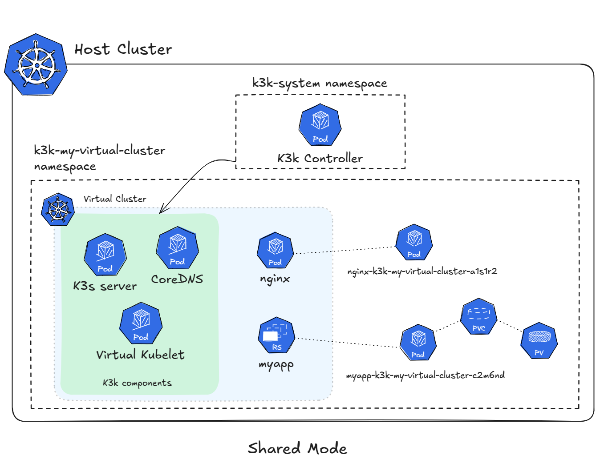
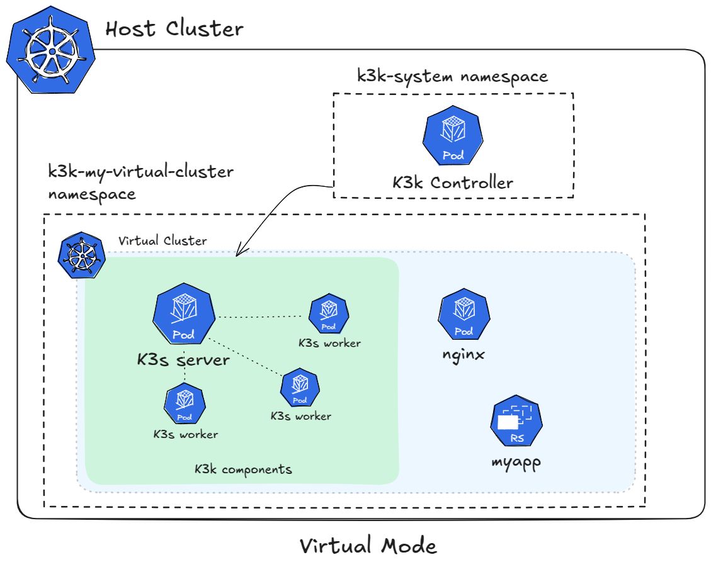

# Architecture

Virtual Clusters are isolated Kubernetes clusters provisioned on a physical cluster. K3k leverages [K3s](https://k3s.io/) as the control plane of the Kubernetes cluster because of its lightweight footprint.

K3k provides two modes of deploying virtual clusters: the "shared" mode (default), and "virtual".

## Shared Mode

The default `shared` mode uses a K3s server as control plane with an [agentless servers configuration](https://docs.k3s.io/advanced#running-agentless-servers-experimental). With this option enabled, the servers do not run the kubelet, container runtime, or CNI. The server uses a [Virtual Kubelet](https://virtual-kubelet.io/) provider implementation specific to K3k, which schedules the workloads and other eventually needed resources on the host cluster. This K3k Virtual Kubelet provider handles the reflection of resources and workload execution within the shared host cluster environment.

### Networking and Storage

Because of this shared infrastructure, the CNI will be the same one configured in the host cluster. To provide the needed isolation, K3k will leverage Network Policies.

The same goes for the available storage, so the Storage Classes and Volumes are those of the host cluster.

### Resource Sharing and Limits

In shared mode, K3k leverages Kubernetes ResourceQuotas and LimitRanges to manage resource sharing and enforce limits.  Since all virtual cluster workloads run within the same namespace on the host cluster, ResourceQuotas are applied to this namespace to limit the total resources consumed by a virtual cluster. LimitRanges are used to set default resource requests and limits for pods, ensuring that workloads have reasonable resource allocations even if they don't explicitly specify them.

Each pod in a virtual cluster is assigned a unique name that incorporates the pod name, namespace, and cluster name. This prevents naming collisions in the shared host cluster namespace.

It's important to understand that ResourceQuotas are applied at the namespace level. This means that all pods within a virtual cluster share the same quota.  While this provides overall limits for the virtual cluster, it also means that resource allocation is dynamic. If one workload isn't using its full resource allocation, other workloads within the *same* virtual cluster can utilize those resources, even if they belong to different deployments or services.

This dynamic sharing can be both a benefit and a challenge.  It allows for efficient resource utilization, but it can also lead to unpredictable performance if workloads have varying resource demands.  Furthermore, this approach makes it difficult to guarantee strict resource isolation between workloads within the same virtual cluster.

GPU resource sharing is an area of ongoing investigation. K3k is actively exploring potential solutions in this area.

### Isolation and Security

Isolation between virtual clusters in shared mode relies heavily on Kubernetes Network Policies.  Network Policies define rules that control the network traffic allowed to and from pods.  K3k configures Network Policies to ensure that pods in one virtual cluster cannot communicate with pods in other virtual clusters or with pods in the host cluster itself, providing a strong foundation for network isolation.

While Network Policies offer robust isolation capabilities, it's important to understand their characteristics:

* **CNI Integration:** Network Policies integrate seamlessly with supported CNI plugins.  K3k leverages this integration to enforce network isolation.
* **Granular Control:** Network Policies provide granular control over network traffic, allowing for fine-tuned security policies.
* **Scalability:** Network Policies scale well with the number of virtual clusters and applications, ensuring consistent isolation as the environment grows.

K3k also utilizes Kubernetes Pod Security Admission (PSA) to enforce security policies within virtual clusters based on Pod Security Standards (PSS).  PSS define different levels of security for pods, restricting what actions pods can perform.  By configuring PSA to enforce a specific PSS level (e.g., `baseline` or `restricted`) for a virtual cluster, K3k ensures that pods adhere to established security best practices and prevents them from using privileged features or performing potentially dangerous operations.

Key aspects of PSA integration include:

* **Namespace-Level Enforcement:** PSA configuration is applied at the namespace level, providing a consistent security posture for all pods within the virtual cluster.
* **Standardized Profiles:** PSS offers a set of predefined security profiles aligned with industry best practices, simplifying security configuration and ensuring a baseline level of security.

The shared mode architecture is designed with security in mind.  K3k employs multiple layers of security controls, including Network Policies and PSA, to protect virtual clusters and the host cluster.  While the shared namespace model requires careful configuration and management, these controls provide a robust security foundation for running workloads in a multi-tenant environment.  K3k continuously evaluates and enhances its security mechanisms to address evolving threats and ensure the highest level of protection for its users.

## Virtual Mode

The `virtual` mode in K3k deploys fully functional K3s clusters (including both server and agent components) as virtual clusters.  These K3s clusters run as pods within the host cluster.  Each virtual cluster has its own dedicated K3s server and one or more K3s agents acting as worker nodes. This approach provides strong isolation, as each virtual cluster operates independently with its own control plane and worker nodes.  While these virtual clusters run as pods on the host cluster, they function as complete and separate Kubernetes environments.

### Networking and Storage

Virtual clusters in `virtual` mode each have their own independent networking configuration managed by their respective K3s servers.  Each virtual cluster runs its own CNI plugin, configured within its K3s server, providing complete network isolation from other virtual clusters and the host cluster.  While the virtual cluster networks ultimately operate on top of the host cluster's network infrastructure, the networking configuration and traffic management are entirely separate.

### Resource Sharing and Limits

Resource sharing in `virtual` mode is managed by applying resource limits to the pods that make up the virtual cluster (both the K3s server pod and the K3s agent pods).  Each pod is assigned a specific amount of CPU, memory, and other resources.  The workloads running *within* the virtual cluster then utilize these allocated resources.  This means that the virtual cluster as a whole has a defined resource pool determined by the limits on its constituent pods.

This approach provides a clear and direct way to control the resources available to each virtual cluster.  However, it requires careful resource planning to ensure that each virtual cluster has sufficient capacity for its workloads.

### Isolation and Security

The `virtual` mode offers strong isolation due to the dedicated K3s clusters deployed for each virtual cluster.  Because each virtual cluster runs its own separate control plane and worker nodes, workloads are effectively isolated from each other and from the host cluster.  This architecture minimizes the risk of one virtual cluster impacting others or the host cluster.

Security in `virtual` mode benefits from the inherent isolation provided by the separate K3s clusters.  However, standard Kubernetes security best practices still apply, and K3k emphasizes a layered security approach.  While the K3s server pods often run with elevated privileges (due to the nature of their function, requiring access to system resources), K3k recommends minimizing these privileges whenever possible and adhering to the principle of least privilege.  This can be achieved by carefully configuring the necessary capabilities instead of relying on full `privileged` mode.  Further information on K3s security best practices can be found in the official K3s documentation: [https://docs.k3s.io/security](https://docs.k3s.io/security) (This link provides general security guidance, including discussions of capabilities and other relevant topics).

Currently security in virtual  mode has a risk of privilege escalation as the server pods run with elevated privileges (due to the nature of their function, requiring access to system resources).

## K3k Components

K3k consists of two main components:

* **Controller:** The K3k controller is a core component that runs on the host cluster. It watches for `Cluster` custom resources (CRs) and manages the lifecycle of virtual clusters. When a new `Cluster` CR is created, the controller provisions the necessary resources, including namespaces, K3s server and agent pods, and network configurations, to create the virtual cluster.
* **CLI:** The K3k CLI provides a command-line interface for interacting with K3k. It allows users to easily create, manage, and access virtual clusters. The CLI simplifies common tasks such as creating `Cluster` CRs, retrieving kubeconfigs for accessing virtual clusters, and performing other management operations.

## Comparison and Trade-offs

K3k offers two distinct modes for deploying virtual clusters: `shared` and `virtual`. Each mode has its own strengths and weaknesses, and the best choice depends on the specific needs and priorities of the user. Here's a comparison to help you make an informed decision:

| Feature | Shared Mode | Virtual Mode |
|---|---|---|
| **Architecture** | Agentless K3s server with Virtual Kubelet | Full K3s cluster (server and agents) as pods |
| **Isolation** | Network Policies | Dedicated control plane and worker nodes |
| **Resource Sharing** | Dynamic, namespace-level ResourceQuotas | Resource limits on virtual cluster pods |
| **Networking** | Host cluster's CNI | Virtual cluster's own CNI |
| **Storage** | Host cluster's storage | *Under development* |
| **Security** | Pod Security Admission (PSA), Network Policies | Inherent isolation, PSA, Network Policies, secure host configuration |
| **Performance** | Smaller footprint, more efficient due to running directly on the host | Higher overhead due to running full K3s clusters |

**Trade-offs:**

* **Isolation vs. Overhead:** The `shared` mode has lower overhead but weaker isolation, while the `virtual` mode provides stronger isolation but potentially higher overhead due to running full K3s clusters.
* **Resource Sharing:** The `shared` mode offers dynamic resource sharing within a namespace, which can be efficient but less predictable. The `virtual` mode provides dedicated resources to each virtual cluster, offering more control but requiring careful planning.

**Choosing the right mode:**

* **Choose `shared` mode if:**
    * You prioritize low overhead and resource efficiency.
    * You need a simple setup and don't require strong isolation between virtual clusters.
    * Your workloads don't have strict performance requirements.
    * Your workloads needs host capacities (GPU)
* **Choose `virtual` mode if:**
    * You prioritize strong isolation.
    * You need dedicated resources and predictable performance for your virtual clusters.

Ultimately, the best choice depends on your specific requirements and priorities. Consider the trade-offs carefully and choose the mode that best aligns with your needs.
